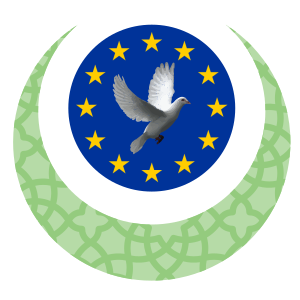

##  موقع الهيئة الأوروبة للمراكز الإسلامية 

موقع الهيئة الأوروبة للمراكز الإسلامية عبارة عن مدونة تهدف على نشر أخبار عن الهيئة ونشاطاتها

## من مزايا المدونة
- تصنيفات تحتوي على مقالات
- وسوم لكل مقال
- نظام تعليقات
- إنخراط
- التواصل 
- أسئلة شائغة
- التعريف بالهيئة وهيكلته
- المشاريع
- المجالات

## لوحة تحكم المدونة 

لوحة تحكم تحتوي على كل ما يتعلق بالمدونة

- الإحصائيات
- الأعضاء
- الصفحة الشخصية
- التصنيفات
- المقالات
- الوسوم
- أخر الأخبار
- طلبات الإنخراط
- الرسائل
- أسئلة شائعة
- إعدادات الموقع

# ملاحظة 
كل خاصية في لوحة تحكم تحتوي على إضافة , تعديل , حذف

## الأشخاص المستهدفين 

هذه المدونة تستهدف الأئمة   , المراكز الإسلامية , الصحافة والإعلام 

## الحقوق 

 الحقوق محفوظة للهيئة الأوروبية للمراكز الإسلامية &copy; 2023  
